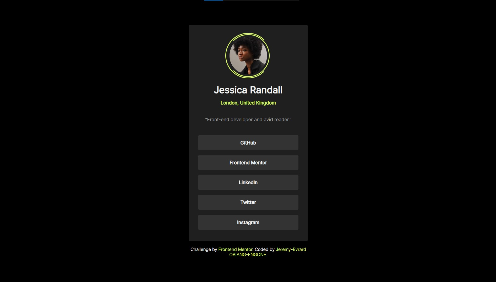

# Frontend Mentor - Social links profile solution

This is a solution to the [Social links profile challenge on Frontend Mentor](https://www.frontendmentor.io/challenges/social-links-profile-UG32l9m6dQ). Frontend Mentor challenges help you improve your coding skills by building realistic projects. 

## Table of contents

- [Overview](#overview)
  - [The challenge](#the-challenge)
  - [Screenshot](#screenshot)
  - [Links](#links)
- [My process](#my-process)
  - [Built with](#built-with)
- [Author](#author)

## Overview

### The challenge

Users should be able to:

- See hover and focus states for all interactive elements on the page

### Screenshot

### Links

- Solution URL: [Here is my repos](https://github.com/Jerems412Dev/social-links-profile-main-challenge)
- Live Site URL: [Here is the site url](https://social-links-profile-main-jerems.vercel.app/)

## My process

### Built with

- Semantic HTML5 markup
- CSS custom properties
- CSS Grid
- Mobile-first workflow

## Author

- Website - [@Jerems](#)
- Frontend Mentor - [@jerems](https://www.frontendmentor.io/profile/Jerems412Dev)
- Twitter - [@jerems](https://www.twitter.com/yourusername](https://x.com/jeremsOb))

